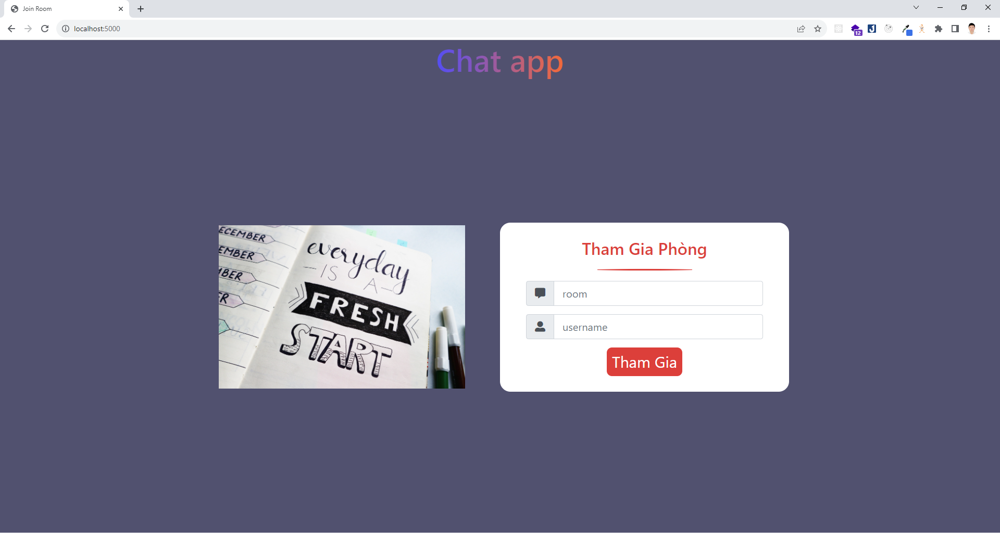
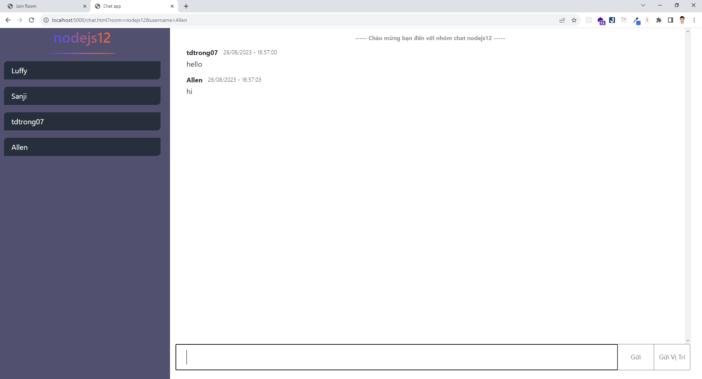

# Ứng dụng chat real time

**GitHub:** https://github.com/ductrong1507/socketio_chat_app

## Installation

_How to installing and setting up chat app real time._

1. Clone the repo
   ```sh
   git clone https://github.com/ductrong1507/socketio_chat_app
   ```
2. Install NPM packages
   ```sh
   npm install
   ```
3. Run project
   ```sh
   npm start
   ```

## Tổng quan dự án

Ứng dụng chat real time đơn giản sử dụng socket io, ngươi dùng có thể nhập tên và join phòng chat theo tên.

#### Trang khởi đầu (_index.html_):

- **Đường dẫn:** "/index.html".
- **Feature:** Hiển thị form để người dùng có thể join vào room chat và đặt tên cho user: _form..._
- **Thành phần:**
  - Form join group chat
    

#### Trang chat (_chat.html_):

- **Đường dẫn:** "/chat.html".
- **Feature:** Đoạn chat giữa các người dùng, thông tin khi có người tham gia hoặc rời khỏi, ngoài ra người dùng còn có thể gửi vị trí : _user list, chat content..._
- **Thành phần:**
  - User list
  - Chat content
    
